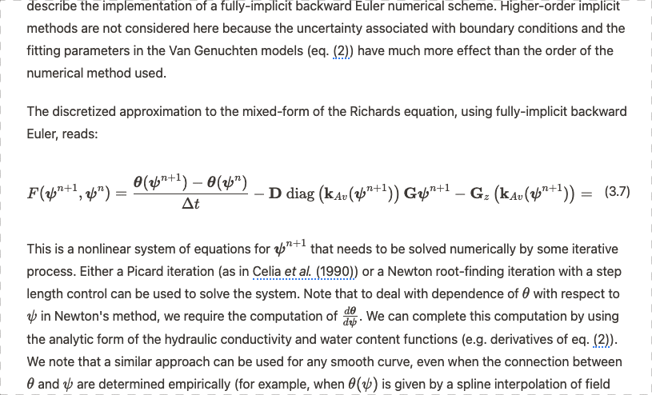
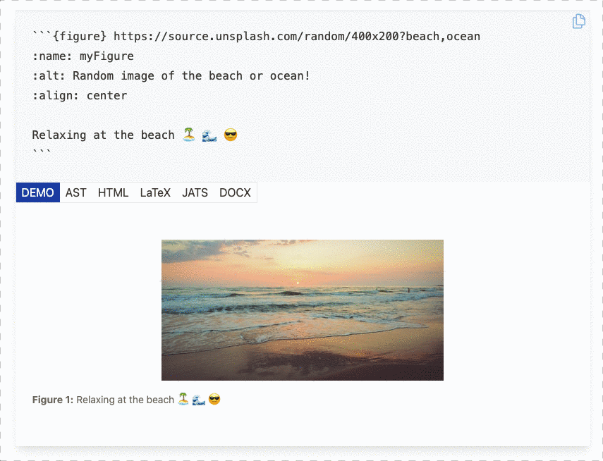
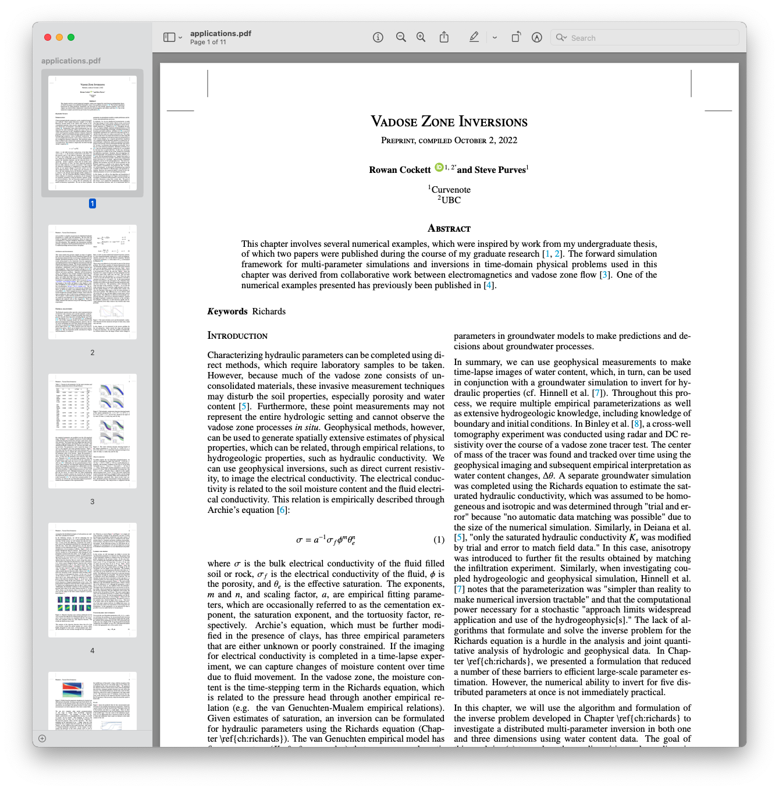

# Cómo usar MyST, sin quedar mystificado 🧙

Un tutorial para evolucionar documentos markdown y cuadernos en datos estructurados

**Autores:** Rowan Cockett1,2 \
**Afiliaciones:** 1Executable Books, 2 Curvenote \
**Licencia:** CC-BY

**Resumen**

Presentamos un conjunto de herramientas de código abierto impulsadas por la comunidad para MyST Markdown ([myst.tools](https://myst.tools)), diseñadas para la comunicación científica, que incluyen un potente marco de autoría compatible con blogs, libros en línea, artículos científicos, informes y artículos de revistas.

## Antecedentes

La comunicación científica actual está diseñada en torno a documentos impresos y acceso restringido a contenidos. En la última década, el movimiento de ciencia abierta ha acelerado el uso de servicios de preimpresión y archivos de datos que están mejorando enormemente la accesibilidad de los contenidos científicos. Sin embargo, estos sistemas no están diseñados para comunicar los resultados científicos modernos, que abarcan **mucho más** que un modelo de literatura académica centrado en artículos.

> Creemos que la forma en que compartimos y comunicamos el conocimiento científico debe evolucionar más allá del statu quo de la publicación en papel y todas las limitaciones del formato impreso.

Las herramientas de comunicación y colaboración que estamos construyendo en el Proyecto Jupyter siguen las recomendaciones de FORCE11 (Bourne _et al._, 2012). Específicamente:

1. repensar la unidad y la forma de la publicación académica;
2. desarrollar herramientas y tecnologías para apoyar mejor el ciclo de vida académico; y
3. incluir datos, software y flujos de trabajo como objetos de investigación de primer nivel.

Al incorporar herramientas profesionales de alta calidad para la comunicación científica en el ciclo de vida de la investigación, creemos que podemos mejorar la recolección y preservación de metadatos académicos (citas, referencias cruzadas, anotaciones, etc.), así como abrir nuevas formas de comunicar ciencia con figuras interactivas y ecuaciones, computación y reactividad.

Las herramientas que está construyendo el Proyecto Jupyter están enfocadas en introducir un nuevo lenguaje de marcado, MyST (Markedly Structured Text), que funciona perfectamente con la comunidad Jupyter para mejorar y promover un nuevo camino hacia la creación y publicación de documentos para libros de texto científicos de próxima generación, blogs y conferencias. Nuestro equipo cuenta actualmente con el apoyo de la [Fundación Sloan](https://sloan.org), ([Subvención #9231](https://sloan.org/grant-detail/9231)).

MyST permite la generación de contenido enriquecido y es un formato poderoso para la comunicación científica y técnica. JupyterBook usa MyST y tiene una adopción amplia en la publicación de tutoriales y contenido educativo centrado en Jupyter Notebooks.

> Los componentes detrás de Jupyter Book se descargan 30.000 veces al día, con 750 mil descargas el mes pasado.

La cadena de herramientas actual utilizada por [JupyterBook] está basada en [Sphinx], un sistema de documentación de código abierto utilizado en muchos proyectos de software, especialmente en el ecosistema Python. `mystjs` es una herramienta similar a [Sphinx], pero diseñada específicamente para la comunicación científica. Además de crear sitios web, `mystjs` también puede ayudarle a crear PDFs científicos, documentos de Microsoft Word y JATS XML (utilizado en publicaciones científicas).

`mystjs` utiliza marcos web modernos y existentes en lugar del sistema de construcción de [Sphinx]. Estas herramientas vienen listas para usar con precarga para una navegación más rápida, cargas de red más pequeñas a través de empaquetadores web modernos, optimización de imágenes y actualización parcial de páginas mediante aplicaciones de una sola página. Muchas de estas características, mejoras de rendimiento y accesibilidad son difíciles, si no imposibles, de crear dentro del sistema de construcción de [Sphinx].

En 2022, el equipo de Executable Books comenzó a documentar la especificación detrás del lenguaje de marcado, llamada [myst-spec](https://github.com/jupyter-book/myst-spec); este trabajo ha permitido que otras herramientas e implementaciones en el ecosistema científico se construyan sobre MyST (p. ej., [herramientas de autoría científica](https://curvenote.com/for/writing) y [sistemas de documentación](https://blog.readthedocs.com/jupyter-book-read-the-docs/)).

El ecosistema `mystjs` fue desarrollado como una colaboración entre [Curvenote], [2i2c] y el equipo de [ExecutableBooks]. La versión inicial de `mystjs` fue publicada originalmente por [Curvenote] como la [CLI de Curvenote](https://curvenote.com/docs/cli) bajo la licencia MIT, y transferida al equipo de [ExecutableBooks] en octubre de 2022. El objetivo del proyecto es habilitar la misma experiencia de contenido enriquecido y autoría que permite [Sphinx] para documentación de software, con un enfoque en tecnologías web-first (Javascript), interactividad, accesibilidad, referencias científicas (p. ej., DOIs y otros identificadores persistentes), salidas PDF profesionales y documentos JATS XML para archivado científico.

## El Proyecto MyST

En este artículo presentamos `mystjs`, que permite ejecutar la popular sintaxis MyST Markdown directamente en un navegador web, abriendo nuevos flujos de trabajo para que los componentes se utilicen en editores basados en web, [directamente en Jupyter](https://github.com/jupyter-book/jupyterlab-myst) y en JupyterLite. Las bibliotecas funcionan con documentos/proyectos MyST Markdown actuales y pueden exportar a [LaTeX/PDF](https://myst.tools/docs/mystjs/creating-pdf-documents), [Microsoft Word](https://myst.tools/docs/mystjs/creating-word-documents) y [JATS](https://myst.tools/docs/mystjs/creating-jats-xml), así como a múltiples plantillas de sitios web usando un renderizador basado en [React moderno](https://myst.tools/docs/mystjs/accessibility-and-performance). Actualmente hay más de 400 revistas científicas compatibles a través de [plantillas](https://github.com/myst-templates), con [nuevas plantillas de LaTeX](https://myst.tools/docs/jtex/create-a-latex-template) que pueden añadirse fácilmente usando un paquete de plantillas basado en Jinja, llamado [jtex](https://myst.tools/docs/jtex).

En nuestro artículo presentaremos una visión general del ecosistema MyST, cómo usar las herramientas MyST junto con Jupyter Notebooks existentes, documentos markdown y JupyterBooks para crear PDFs profesionales y sitios web interactivos, libros, blogs y artículos científicos. Prestamos especial atención a las incorporaciones relacionadas con datos estructurados, estándares de publicación (p. ej., esfuerzos para representar Notebooks como JATS XML), [metadatos de portada](https://myst.tools/docs/mystjs/frontmatter) enriquecidos y la activación de [referencias cruzadas](https://myst.tools/docs/mystjs/cross-references) e [identificadores persistentes](https://myst.tools/docs/mystjs/external-references) con tooltips interactivos al pasar el cursor ([ORCID, RoR](https://myst.tools/docs/mystjs/frontmatter), [RRIDs](https://myst.tools/docs/mystjs/external-references#research-resource-identifiers), [DOIs](https://myst.tools/docs/mystjs/citations), [intersphinx](https://myst.tools/docs/mystjs/external-references#intersphinx), [wikipedia](https://myst.tools/docs/mystjs/external-references#wikipedia-links), [JATS](https://myst.tools/docs/mystjs/typography), [código de GitHub](https://myst.tools/docs/mystjs/external-references#github-links), ¡y más!). Estos metadatos enriquecidos y el contenido estructurado pueden usarse directamente para mejorar la comunicación científica, tanto en la autopublicación de libros, blogs y sitios web de laboratorio, como en revistas que incorporan Jupyter Notebooks.

## Características de MyST

MyST está enfocado en la escritura científica y en garantizar que las citas sean de primera clase tanto para escribir como para leer (véase la Figura 1).

**Figura 1**: Las citas se muestran con una ventana emergente directamente en línea.

MyST tiene como objetivo mostrar la mayor cantidad de información en contexto posible; por ejemplo, la Figura 2 muestra una experiencia de lectura para una ecuación referenciada: puede **hacer clic en la referencia** directamente y ver la ecuación, sin perder ningún contexto, lo que en última instancia le ahorra tiempo. Head _et al._ (2021) encontraron que estas ideas tanto mejoraron la experiencia general de lectura de artículos como permitieron a los investigadores responder preguntas sobre un artículo **un 26% más rápido** en comparación con un PDF tradicional.

**Figura 2**: Las referencias cruzadas en contexto mejoran la experiencia de lectura.

Uno de los objetivos subyacentes importantes de practicar la reproducibilidad es compartir más de los métodos y datos detrás de un trabajo científico, para que otros investigadores puedan tanto verificar como construir sobre sus hallazgos. Una de las formas más interesantes de impulsar la reproducibilidad es vincular los documentos directamente a los datos y la computación. En la Figura 3, mostramos salidas de un Jupyter Notebook que forman parte directamente de la narrativa científica publicada.

**Figura 3**: Integración de datos, interactividad y computación en un artículo MyST.

Para impulsar todas estas características, el contenido de un documento MyST debe estar bien definido. Esto es fundamental para alimentar los tooltips interactivos, las citas vinculadas y la compatibilidad con estándares de publicación científica como el Journal Article Metadata Tag Suite (JATS). Contamos con una especificación emergente para MyST, [`myst-spec`](https://spec.myst.tools), que tiene como objetivo capturar esta información y transformarla entre muchos formatos diferentes, como PDF, Word, JSON y JATS XML (Figura 4). Esta especificación se alcanza a través de un proceso comunitario de Propuesta de Mejora de MyST ([MEP](https://compass.executablebooks.org/en/latest/meps.html)).

**Figura 4**: Los datos detrás de MyST son **estructurados**, lo que significa que podemos transformarlos en muchos tipos de documentos diferentes y usarlos para impulsar todo tipo de características interesantes.

Una de las formas comunes de comunicación científica actual es a través de documentos PDF. MyST tiene un excelente soporte para crear documentos PDF, utilizando una biblioteca de plantillas basada en datos llamada `jtex`. ¡El documento de la Figura 5 fue creado usando MyST!

**Figura 5**: Un renderizado en PDF mediante MyST.

## Conclusión

Hay muchas oportunidades para mejorar la comunicación científica abierta, hacerla más interactiva, accesible, más reproducible, y tanto producir como utilizar datos estructurados a lo largo del proceso de investigación y escritura. El ecosistema de herramientas `mystjs` está diseñado con datos estructurados en su núcleo. Nos encantaría que lo probara: aprenda a comenzar en <https://myst.tools>.

## Referencias

Bourne, Philip E., Clark, Timothy W., Dale, Robert, De Waard, Anita, Herman, Ivan, Hovy, Eduard H., Shotton, David. (2012) "Mejorando el Futuro de las Comunicaciones de Investigación y la e-Scholarship". FORCE11. doi:10.4230/DAGMAN.1.1.41

Head, A., Lo, K., Kang, D., Fok, R., Skjonsberg, S., Weld, D. S., & Hearst, M. A. (2021, mayo). Augmenting Scientific Papers with Just-in-Time, Position-Sensitive Definitions of Terms and Symbols. Proceedings of the 2021 CHI Conference on Human Factors in Computing Systems. 10.1145/3411764.3445648

[2i2c]: https://2i2c.org/
[curvenote]: https://curvenote.com
[docutils]: https://docutils.sourceforge.io/
[executablebooks]: https://executablebooks.org/
[jupyterbook]: https://jupyterbook.org/
[jupyterlab-myst]: https://github.com/jupyter-book/jupyterlab-myst
[sphinx]: https://www.sphinx-doc.org/
