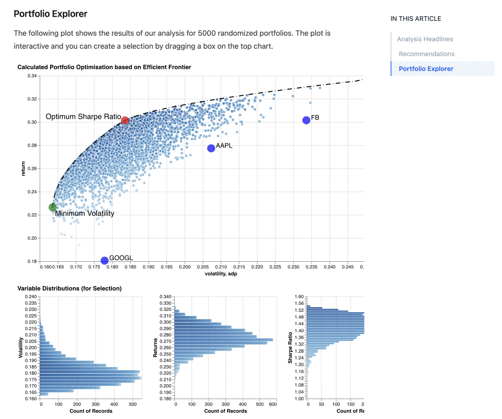

+++ { "kind": "split-image" }

Inicio rápido

## Cuadernos Reproducibles de Conocimiento del Riesgo de Desastres

Colección de cuadernos Markdown y Jupyter estructurados, replicables e interactivos en Gestión del Riesgo de Desastres.

{button}`Ver la guía <01-paper.md>`

+++ { "kind": "justified"}

¿Qué puedes hacer?

## Herramientas para una comunicación científica moderna

:::::{grid} 1 2 2 2
::::{card}
:url: 01-paper.md
:footer: Artículos científicos

:::{image} ./images/pdf-two-column.png
:height: 256px
:::

Exporta tus documentos a PDF, Word o LaTeX con un solo comando.
::::

::::{card}
:url: 02-notebook.ipynb
:footer: Figuras interactivas

:::{image} ./images/structured-data.gif
:height: 256px
:::

Integra notebooks de Jupyter con figuras dinámicas e interactivas.
::::

:::::

+++ {"kind": "logo-cloud"}

Ecosistema que lo hace posible

::::{grid} 1 2 3 3

:::{figure} ./images/jupyter.png
:height: 100px
Jupyter
:::

:::{figure} ./images/mystmd.svg
:height: 100px
MyST Markdown
:::

:::{figure} ./images/nasa-tops.webp
:height: 100px
NASA TOPS
:::

::::

{button}`Ver documentación <https://mystmd.org/guide>`

+++ { "kind": "centered"}

## Empieza en minutos

Escribe en Markdown, ejecuta en Jupyter, publica en la web.

### Publicación científica moderna

{button}`Abrir el paper <01-paper.md>` {button}`Ver el notebook <02-notebook.ipynb>`

[Ver documentación completa](https://mystmd.org/guide)

+++ { "kind": "justified"}

Capacidades

## Todo lo que necesitas para publicar ciencia

Desde la escritura hasta la publicación, con herramientas de primer nivel.

### Ecuaciones, citas y exportación en un solo flujo

{button}`Explorar capacidades <01-paper.md>` Soporte completo para LaTeX, BibTeX y más.

[Ver todas las funciones](https://mystmd.org/guide)

:::::{grid} 1 2 3 3
::::{card}
:footer: Ecuaciones

:::{image} ./images/equations.gif
:height: 150px
:::

Soporte nativo para LaTeX y notación matemática compleja.
::::

::::{card}
:footer: Citas

:::{image} ./images/citations.png
:height: 150px
:::

Gestión de referencias bibliográficas integrada con BibTeX.
::::

::::{card}
:footer: Exportación PDF

:::{image} ./images/export-pdf.png
:height: 150px
:::

Genera documentos de alta calidad listos para publicar.
::::

:::::
